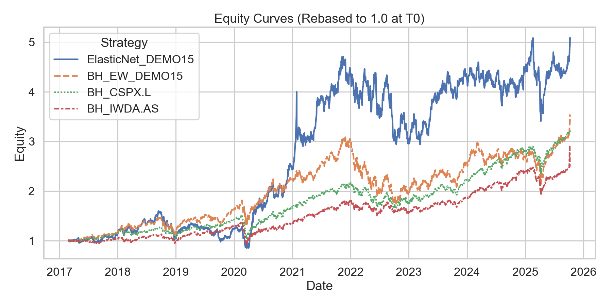

# ML Equity Backtester — Walk-Forward Machine Learning and Quantitative Strategy Evaluation

This is a small project which I use to explore workflows around **backtesting trading strategies** with a focus on **ML driven strategies**, including:
- Fetching market data via API
- Managing, curating, storing, and preparing data
- Computing features (Lookback-skip momentum, volatility, ...)
- Generating predictions/signals to inform trading strategies
- Backtesting strategies against historical market data
- Evaluating strategies using typical metrics (TR, CAGR, Sharpe, Vol, MaxDD, ...)
- Documenting and reporting results

So far, I've implemented basic Buy-and-Hold, Monthly-Rebalance, and Select-Top-N strategies.

I am using Pixi for my python environment, but you can use any other environment. However, by using Pixi you can just follow along and run pre-defined Pixi tasks. If you are using any other environment, you can recreate the tasks by running the commands documented in the pixi.toml.

Currently, to fetch market data an Alpha Vantage API key is needed (they provide a free tier). I am planning on providing synthetic market data in a future update such that anyone can run tests without requiring an API key.

---

## Project overview

- Modular backtesting framework for ML-based and rule-based strategies
- Includes Top-N selection, Buy-and-Hold, and Monthly-Rebalance baselines
- Walk-forward ElasticNet model for out-of-sample testing
- Automated benchmark comparison and performance reporting
- Designed for easy extension (new models, new features, new universes)

---

## Quickstart Demo (requires Alpha Vantage API key)

1. Clone the repository and install the environment:
```bash
git clone https://github.com/ElPhysico/ml-equity-backtester.git
cd ml-equity-backtester

pixi install
pixi run dev-install
```

2. Create the dotenv file `.env`
```bash
touch .env
```
and paste your API key inside, using the format `ALPHA_VANTAGE_API_KEY=yourkey`.

3. Download the demo universe (15 tickers):
```bash
pixi run demo_download init
```

4. [Optional] Download benchmarks (2 tickers: CSPX.L (SP500), IWDA.AS (MSCI World)):
```bash
pixi run benchmarks_download init
```

5. Backtest the demo strategy:
```bash
pixi run demo_elasticnet_topn
```

The demo uses the config file `config/DEMO15_config.yaml` and you should see an output log similar to this:
```bash
10-10-2025 01:14:20 | INFO | Run ID: 20251009-231419+0000_87c9ac90
10-10-2025 01:14:20 | INFO | Strategy start: 2017-02-28, end: 2025-10-07
10-10-2025 01:14:20 | INFO | Top-N selected: 5 | cost_bps: 5.0
10-10-2025 01:14:20 | INFO | Metrics | TR: 392.30% | Sharpe: 0.73 | CAGR: 20.35% | MaxDD: 46.68% | Ann. Vol: 33.09% | Ann. avg. turnover: 104.83%
10-10-2025 01:14:20 | INFO | Performance vs | [BH_EW_DEMO15] 5.09% CAGR, 0.02 Sharpe | [BH_EW_IWDA.AS] 9.20% CAGR, 0.04 Sharpe | [BH_EW_CSPX.L] 5.85% CAGR, -0.15 Sharpe
10-10-2025 01:14:20 | INFO | Output files saved to outputs/backtests/20251009-231419+0000_87c9ac90
```

### Example Strategy vs. Benchmark Performance


Here, the prefix `BH_EW` stands for Buy-and-Hold Equal Weight.

---

## The DEMO15 Universe

Since the free Alpha Vantage market data does not cover dividend- and split-adjusted prices, we are forced to manually avoid such tickers that pay dividends or had recent stock splits. Furthermore, the free tier only supports 25 API calls per day.

The DEMO15 universe contains 15 liquid, non-dividend-paying companies for which the most recent stock split was in 2015-07-15 (NFLX). With 25 API calls per day, one can easily maintain the whole universe plus the two benchmarks as a toy model universe for experiments.

---

## Outputs

Backtest runs are saved under `outputs/backtests/` where each run has a unique ID following the schema `YYYYMMDD-HHMMSS_<shortsha>`. The saved data typically contains the equity curve, the strategy metrics, extensive meta data, and where applicable ticker selections and weights, as well as turnover information. If benchmarks were used for the backtest, there will also be a subfolder containing the benchmark equities as well as an `overlay.png` comparing the strategy against the benchmarks visually.

---

## Dependencies & Setup

Main libraries are defined in `pixi.toml` and include:
- numpy
- pandas
- scikit-learn
- matplotlib
- seaborn
- alpha_vantage
- python-dotenv
- jupyter
- pyarrow
- pip

Install via:
```bash
pixi install
pixi run dev-install
```

---

## Roadmap

- Synthetic market data simulator for various scenarios and market cycles
- Random Forest walk-forward trainer
- Visualisations

---

## License

MIT License - feel free to use and adapt with attribution.

---

## Author

Kevin Klein

LinkedIn: https://www.linkedin.com/in/kevin-klein-9a2342195/

GitHub: https://github.com/ElPhysico/
