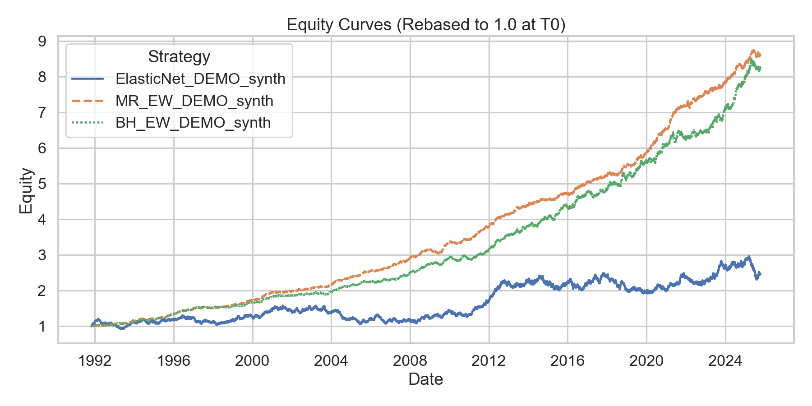

# ML Equity Backtester — Walk-Forward Machine Learning and Quantitative Strategy Evaluation

In this project I explore workflows for **backtesting trading strategies**, with a focus on **machine-learning-driven approaches**, including:
- Fetching market data via API
- Managing, curating, storing, and preparing data
- Computing features (Lookback-skip momentum, volatility, ...)
- Generating predictions/signals to inform trading strategies
- Backtesting strategies against historical market data
- Evaluating strategies using typical metrics (TR, CAGR, Sharpe, Vol, MaxDD, ...)
- Documenting and reporting results
- Creating synthetic market data with various flavors
- Studying equity price theory (GBM, fat tails, regimes, correlation, ...)

So far, I've implemented basic Buy-and-Hold, Monthly-Rebalance, and Select-Top-N strategies.

I am using Pixi for my python environment, but you can use any other environment. However, by using Pixi you can just follow along and run pre-defined Pixi tasks. If you are using any other environment, you can recreate the tasks by running the commands documented in the pixi.toml.

Currently, to fetch market data an Alpha Vantage API key is needed (they provide a free tier). I am planning on providing synthetic market data in a future update such that anyone can run tests without requiring an API key.

---

## Project overview

- Modular backtesting framework for ML-based and rule-based strategies
- Includes Top-N selection, Buy-and-Hold, and Monthly-Rebalance baselines
- Walk-forward ElasticNet model for out-of-sample testing
- Automated benchmark comparison and performance reporting
- Designed for easy extension (new models, new features, new universes)
- Built-in synthetic market data simulator

---

## Strategy: ElasticNet (Top-N) - Features & Label introduction
- **Label**: Next-month simple return from month-end `t` to `t+1`
- **Features (monthly, cross-sectional)**:
    - Momentum: log returns over `[P, skip]` months (lookback, skip recent months)
    - Volatility: realized std over 1m window
- **Selection**: Rank model scores; hold Top-N equal-weight next month; trading cost given by `cost_bps`
- **Walk-forward**: Train on data `<t`, predict at `t`, and evaluate on `t+1`

---

## Quickstart Demo using synthetic data

1. Clone the repository and install the environment:
```bash
git clone https://github.com/ElPhysico/ml-equity-backtester.git
cd ml-equity-backtester

pixi install
pixi run dev-install
```

2. Backtest the demo strategy:
```bash
pixi run demo_synth_elasticnet_topn
```

The demo uses the config file `config/DEMO_synth_config.yaml` and you should see an output log similar to this:
```bash
11-10-2025 00:09:27 | INFO | Run ID: 20251010-220925_87c9ac90
11-10-2025 00:09:27 | INFO | Strategy start: 1991-10-31, end: 2025-10-10
11-10-2025 00:09:27 | INFO | Top-N selected: 5 | cost_bps: 5.0
11-10-2025 00:09:27 | INFO | Metrics | TR: 623.87% | Sharpe: 0.56 | CAGR: 6.00% | MaxDD: 30.09% | Ann. Vol: 11.21% | Ann. avg. turnover: 62.32%
11-10-2025 00:09:27 | INFO | Performance vs | [BH_EW_DEMO_synth] 2.09% CAGR, -0.49 Sharpe
11-10-2025 00:09:27 | INFO | Output files saved to outputs/backtests/20251010-220925_87c9ac90
```

### Example Strategy vs. Benchmark Performance

The chart below shows the cumulative equity curve of the strategy versus the configured benchmarks, normalized to 1.0 at the start date.



Here, the prefix `BH` stands for *Buy-and-Hold*, `MR` for *Monthly Rebalance*, and `EW` for *Equal Weight*.

---

## The DEMO_synth Universe

Currently, this universe only features simple **geometric Brownian motion (GBM)** equity trajectories. All tickers are independent GBMs with shared μ and σ; diversification is therefore strong. Upcoming versions will add correlation and fat tails.

## Quickstart Demo using real market data (requires Alpha Vantage API key)

1. Clone the repository and install the environment:
```bash
git clone https://github.com/ElPhysico/ml-equity-backtester.git
cd ml-equity-backtester

pixi install
pixi run dev-install
```

2. Create the dotenv file `.env`
```bash
touch .env
```
and paste your API key inside, using the format `ALPHA_VANTAGE_API_KEY=yourkey`.

3. Download the demo universe (15 tickers):
```bash
pixi run demo_download init
```

4. [Optional] Download benchmarks (2 tickers: CSPX.L (SP500), IWDA.AS (MSCI World)):
```bash
pixi run benchmarks_download init
```

5. Backtest the demo strategy:
```bash
pixi run demo15_elasticnet_topn
```

The demo uses the config file `config/DEMO15_config.yaml` and you should see an output log similar to this:
```bash
10-10-2025 13:54:30 | INFO | Run ID: 20251010-115430_87c9ac90
10-10-2025 13:54:30 | INFO | Strategy start: 2017-02-28, end: 2025-10-09
10-10-2025 13:54:30 | INFO | Top-N selected: 5 | cost_bps: 5.0
10-10-2025 13:54:30 | INFO | Metrics | TR: 406.06% | Sharpe: 0.74 | CAGR: 20.72% | MaxDD: 46.68% | Ann. Vol: 33.09% | Ann. avg. turnover: 104.83%
10-10-2025 13:54:30 | INFO | Performance vs | [BH_EW_DEMO15] 4.91% CAGR, 0.01 Sharpe | [BH_CSPX.L] 6.26% CAGR, -0.14 Sharpe | [BH_IWDA.AS] 9.46% CAGR, 0.04 Sharpe
10-10-2025 13:54:30 | INFO | Output files saved to outputs/backtests/20251010-115430_87c9ac90
```

### Example Strategy vs. Benchmark Performance

The chart below shows the cumulative equity curve of the strategy versus the configured benchmarks, normalized to 1.0 at the start date.


Here, the prefix `BH` stands for *Buy-and-Hold*, `MR` for *Monthly Rebalance*, and `EW` for *Equal Weight*.

---

## The DEMO15 Universe

Since the free Alpha Vantage market data does not cover dividend- and split-adjusted prices, we are forced to manually avoid such tickers that pay dividends or had recent stock splits.

The DEMO15 universe contains 15 liquid, non-dividend-paying stocks whose most recent split occurred in July 2015 (Netflix).
With the Alpha Vantage free-tier limit of 25 calls per day, the universe plus two benchmarks can be maintained comfortably for experiments.

---

## Outputs & Reproducibility

Backtest runs are saved under `outputs/backtests/` where each run has a unique ID following the schema `YYYYMMDD-HHMMSS_<shortsha>`.

Each run folder contains a `run_meta.json` file summarizing parameters, metrics, strategy and training information, ensuring full reproducibility.

Further saved data typically includes the equity curve, the strategy metrics, and where applicable ticker selections and weights, as well as turnover information.

If benchmarks were used for the backtest, there will also be a subfolder containing the benchmark equities as well as an `overlay.png` comparing the strategy against the benchmarks visually.

---

## Dependencies & Setup

Main libraries are defined in `pixi.toml` and include:
| Library | Purpose |
|----------|----------|
| **numpy**, **pandas** | Core data handling and numerical operations |
| **scikit-learn** | Machine learning models |
| **matplotlib**, **seaborn** | Visualization and plotting |
| **alpha_vantage** | Market data fetching via API |
| **python-dotenv** | Load environment variables (API keys) |
| **pyarrow** | Fast serialization (Parquet file support) |
| **jupyter** | Interactive development and exploration |
| **pixi**, **pip** | Environment and dependency management |

Install via:
```bash
pixi install
pixi run dev-install
```

---

## Roadmap

- Expanding synthetic market data simulator for various scenarios and market cycles
- Random Forest walk-forward trainer
- Stress-testing and risk safeguards (e.g., exit-to-cash triggers, drawdown caps)
- Visualizations and reporting enhancements

---

## License

MIT License - feel free to use and adapt with attribution.

---

## Author

Kevin Klein

LinkedIn: https://www.linkedin.com/in/kevin-klein-9a2342195/

GitHub: https://github.com/ElPhysico/
